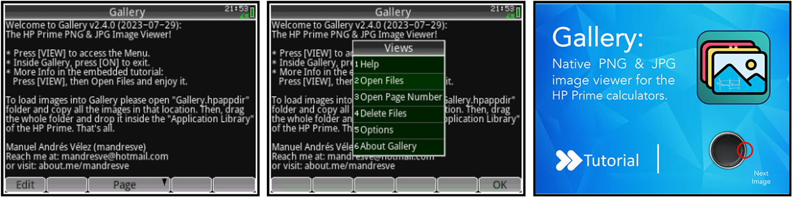

# Gallery
**Gallery**: The HP Prime PNG/JPG Image Viewer.

# How to Install & Use Gallery
1.  **Check Firmware Version**
    
    -   Before proceeding, ensure that your calculator's firmware is up-to-date.
2.  **Copy the `Gallery.hpappdir` Folder**
    -   Uncompress the ZIP file and locate the `Gallery.hpappdir` folder provided.
    -   Copy this folder to a convenient and accessible location on your PC. For example, you can place it on your desktop.
3.  **Download and Install HP Connectivity Kit & HP Prime Virtual Emulator**
    
    -   Download the HP Connectivity Kit and HP Prime Virtual Emulator from [here](https://hpcalcs.com/download/).
    -   Install the downloaded applications on your PC.
4.  **Connect Your Calculator to PC (or use the Virtual Emulator)**
    
    -   Run the HP Connectivity Kit on your PC.
    -   Connect your HP calculator to your PC using an appropriate cable. Alternatively, you can use the HP Prime Virtual Emulator if you don't have the physical calculator.
5.  **Add the `Gallery.hpappdir` Folder to HP Connectivity Kit**
    
    -   In the HP Connectivity Kit, find the left pane or "Application Library" category.
    -   Drag and drop the `Gallery.hpappdir` folder into the "Application Library" category in the left pane.

You have now successfully installed the application on your HP calculator or virtual emulator. Enjoy using the Gallery app!

# Loading Images into Gallery
1.  **Open `Gallery.hpappdir` Folder**
    
    -   Navigate to the location where you copied the `Gallery.hpappdir` folder on your PC.
2.  **Important Note: Do Not Remove `icon.png` or `*.hpapp...` files**
    
    -   Ensure that the `Gallery.hpappdir` folder contains a file named `icon.png`.
    -   **Do not remove or delete this `icon.png` file**, as it is essential for the proper functioning of the Gallery app on your HP Prime calculator.
    - Other `image` files can be removed. 
    - Files that are not images should not be removed.
3.  **Copy Images into the Folder**
    -   Make sure you have all the images you want to add to the Gallery app.
    -   Copy all the images into the `Gallery.hpappdir` folder.

4.  **Transfer Gallery to HP Prime**
    
    -   Connect your HP Prime calculator to your PC using the HP Connectivity Kit or use the Virtual Emulator.
    -   Run the HP Connectivity Kit on your PC. 
    -   In the HP Connectivity Kit, locate the "Application Library" category on the left pane.
    -   Drag the entire `Gallery.hpappdir` folder from your PC and drop it inside the "Application Library" category in the HP Connectivity Kit.
5.  **Completing the Process**
    
    -   The images, along with the essential files, have been successfully loaded into the Gallery app on your HP Prime calculator.

You can now enjoy viewing the images in the Gallery app on your HP Prime without any issues.

# How to use Gallery
1.  **Accessing the Menu**
    
    -   Press the [VIEW] button on your HP Prime calculator to access the app's menu.
2.  **Exiting the Image Gallery**
    
    -   To exit from the image Gallery and return to the previous screen or main menu, press the [ON] button.
3.  **Inverting Colors**
    
    -   To invert colors in the displayed image, press the [+/-] button.
4.  **Blank Screen (Blackout)**
    
    -   Press the [DEL] button to temporarily blank the screen (blackout).
5.  **Browsing Between Images**
    
    -   Use the D-Pad (Directional Pad) to browse between images. Press the appropriate Left or Right key to navigate through the images.
6.  **Using the Touchscreen and Keyboard**
    -   **Touchscreen Operation**:
        -   To move or pan the image, drag your finger across the touchscreen.
        -   To zoom in, use a two-finger pinch gesture, bringing your fingers closer together.
        -   To zoom out, use a two-finger spread gesture, moving your fingers apart.
    -   **Keyboard Navigation**:
        -   If you prefer using the physical buttons, you can navigate as follows:
            -   Use the [4] (left), [8] (up), [6] (right), and [2] (down) arrow keys to move the image.
            -   To zoom in, press the [+] button.
            -   To zoom out, press the [-] button.
7.  **Restoring Zoom/Pan to Default**
    
    -   If you have zoomed in or panned the image and want to reset it to the default view, press the [5] button.
8.  **Hiding the Gallery**
    
    -   To hide the Gallery app and return to the main screen or the previous application, press the [HOME] button.

# Tips and Tricks
1.  **Image Compression for Upload**
    
    -   Before uploading images to the Gallery, consider compressing PNG or JPG files. Compressed images take up less storage space and load faster, enhancing the overall performance of the app.
    -   Click [here](https://tinypng.com) to access an image compression tool that can help you reduce file sizes without compromising quality.
2.  **Preferred Image Specifications**
    
    -  For optimal display and performance, it is recommended to use images with the following specifications:
        -   Image Size: 320x240 pixels
        -   Bit-Depth: 8-bit
    -   Images matching these specifications tend to work better within the Gallery app and ensure smoother navigation.
3.  **Support for Various Image Sizes**
    
    -  Don't worry about image sizes that do not match the specified dimensions. The Gallery app is designed to support images of any size, so you can freely explore a wide variety of pictures without limitations.

# How to Modify and Compile Gallery Source Code

1.  **Download the Repository**
    
    -   Download this [GitHub repository](https://github.com/mandresve/Gallery) to your local machine.
    -   Extract the ZIP file to a convenient location on your computer.
2.  **Locate the Gallery.hpappdir Folder**
    
    -   Navigate to the `Gallery.hpappdir` folder in the downloaded repository. This contains the source code and files for the Gallery app.
3.  **Transfer to Your Calculator or Emulator**
    
    -   Connect your HP Prime calculator to your PC using the HP Connectivity Kit or the Virtual Emulator.
    -   Transfer the `Gallery.hpappdir` folder to your calculator or emulator using the appropriate method.
4.  **Open the Gallery App in HP Connectivity Kit**
    
    -   Double-click on the Gallery app inside the HP Connectivity Kit's "Application Library." This opens the properties dialog for the Gallery app.
5.  **Edit the Source Code**
    
    -   Inside the properties dialog, go to the "Program" tab to view and edit the source code of the Gallery app.
6.  **Make Modifications**
    
    -   Use the built-in text editor in the HP Connectivity Kit to modify the source code of the Gallery app.
    -   Make the desired changes to add new features, improve functionality, or customize the app according to your preferences.
7.  **Save Modifications**
    
    -   After making the necessary modifications, save the changes using the HP Connectivity Kit's menu options.
8.  **Test the Modified App**
    
    -   Once you have saved the modifications, test the app on your HP Prime calculator or emulator to ensure that the changes work as intended.
    -   Run the Gallery app on your calculator to see the effects of your modifications.
9.  **Iterate and Refine**
    
    -   If needed, continue iterating, refining, and testing the app based on any further changes you wish to implement.

10. **Notes:**

-   For clarity purposes, the plain source code is located as an external file: **`Gallery.hpp`**. This file contains the actual source code for the Gallery app in the HP-PPL Language.
    
-   The syntax used for the Gallery app is **HP-PPL Language**. If you need more information about this language or its usage, you can refer to the user manual available [here](http://h10032.www1.hp.com/ctg/Manual/c05332710.pdf).
    
-   The release version of the Gallery app has a shrinked code, which means unnecessary characters or spaces have been removed to save some bytes and optimize the app's size.

Remember to respect any licensing restrictions associated with the original Gallery app source code. If you plan to share your modified version, consider contributing back to this repository or providing appropriate credit to the original developer.

# Changelog
**28-07-23 - v2.4.0.**

-   Support for the latest firmware in HP Prime G1 & G2 Models.
-   New Options menu to control embedded options.
-   New File sorting method for improved reliability.
-   New File Opening/Delete/Locate methods for enhanced stability.
-   Hide icon file for a cleaner interface.
-   New tutorial as default images for user guidance.
-   Added fit-to-screen feature for better image viewing.
-   Overall experience optimization for smoother usage.
-   Source code released on GitHub for community collaboration and improvement.

**07-08-17 - v2.3.0.**

-   JPG/PNG File support under 10077 or newer Firmware!
-   Improved App size and stability.
-   Reduced loading time and no flickering.
-   Improved file transfer.
-   New Functions:
    -   "Go To Page" for easier navigation.
    -   Displaying the file name for better identification.

**21-04-16 - v2.1.0.**

-   Added: JPG/PNG File support under 10077 Firmware!
-   Capable to run in 10077 Firmware.
-   Improved: App Size and Stability.
-   Improved: App Speed.
-   Improved: RAM Memory Management.
-   Improved: File Transfer.
-   New Icon and Samples.

**23-06-15 - v2.0.0.**

-   Fixed version to run on 8151 (17-06-15) Firmware.
-   Added: Zoom feature with Touchscreen.
-   Improved: Zoom, Stability, Velocity, App Size.

**24-05-15 - v1.1.3.**

-   Added: Move feature with Touchscreen.
-   Added: Invert Color.
-   Added: Panic Button.
-   Improved: Zoom, Stability, Resolution Capabilities, Velocity, App Size.

**19-05-15 - v1.0.6.**

-   Added: Move feature with Keyboard.
-   Improved: Stability, Resolution Capabilities, App Size.

**19-05-15 - v1.0.2.**

-   Added: Zoom feature with Keyboard.
-   Added: Multi-Image Browsing.
-   Improved: Stability.

**18-05-15 - v1.0.0. Initial Release**
